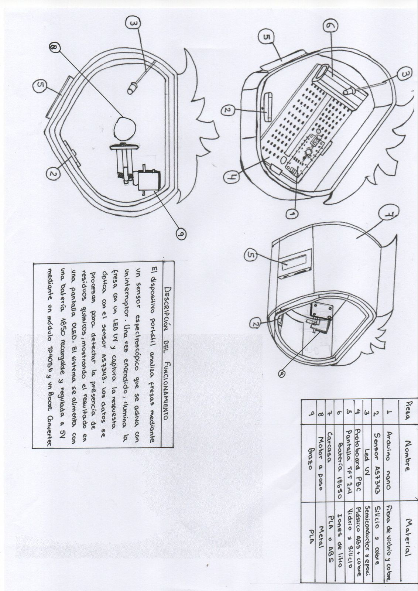

# 📦 Bocetos del Proyecto de Detección de Pesticidas en Fresas

En esta sección se presentan los **tres bocetos desarrollados** durante la fase de diseño del dispositivo.  
Cada propuesta busca detectar la presencia de **profenofos** en fresas mediante técnicas ópticas, priorizando la **portabilidad**, **bajo costo** y **facilidad de uso en campo**.

---

## 🧩 **Boceto 1 – Caja con cámara multiespectral**

**Descripción:**  
Prototipo inicial basado en una **cámara multiespectral profesional** dentro de una caja cerrada para aislar la luz ambiental.  
El sistema captura la firma espectral completa del fruto, ofreciendo alta precisión.

**Ventajas:**  
- Alta calidad y resolución espectral.  
- Resultados científicos muy precisos.  

**Desventajas:**  
- **Costo elevado** de los sensores multiespectrales (fuera del alcance de pequeños productores).  
- Difícil mantenimiento y calibración.  

**Conclusión:**  
Fue descartado por su alto costo, aunque sirvió como referencia teórica para definir los rangos espectrales ideales.

---

## 💡 **Boceto 2 – Escáner espectral con luz UV y pantalla integrada**

**Descripción:**  
Dispositivo tipo **escáner portátil**, inspirado en un lector de documentos, que **emite luz ultravioleta (UV)** sobre la superficie de la fresa.  
Incluye una **pequeña pantalla** que muestra resultados instantáneos de contaminación.

**Ventajas:**  
- Interfaz visual directa.  
- Diseño atractivo y ergonómico.  

**Desventajas:**  
- Requiere componentes UV y pantalla de alto costo.  
- Mayor consumo energético y complejidad electrónica.  

**Conclusión:**  
Aunque innovador, su precio y mantenimiento limitan su aplicación práctica en campo.

---

## 🍓 **Boceto 3 – Sistema espectral AS7343 con caja giratoria (Versión actual)**

**Descripción:**  
Diseño final y **versión actualmente en desarrollo**, basado en el **sensor espectral AS7343**, que trabaja en el rango **VIS/NIR (350–1000 nm)**.  
El sistema incluye una **caja protectora opaca** para evitar interferencias de luz externa y un **motor que rota la fresa** para obtener lecturas desde diferentes ángulos.  

**Ventajas:**  
- Sensor de **bajo costo y buena sensibilidad espectral**.  
- **Diseño portátil**, estable y fácil de limpiar.  
- Ideal para entornos agrícolas y pruebas de campo.  

**Conclusión:**  
Seleccionado como **modelo final** por su equilibrio entre precisión, accesibilidad y costo.  
Representa una solución práctica para la detección de residuos de profenofos en frutas.

---

### ✨ **Resumen Comparativo**

| Boceto | Sensor principal | Costo | Portabilidad | Complejidad | Estado |
|:-------|:-----------------|:------:|:--------------:|:-------------:|:--------:|
| 1 | Cámara multiespectral | 💰💰💰 | 🧳 | ⚙️⚙️⚙️ | Descartado |
| 2 | Escáner UV con pantalla | 💰💰 | 🧳🧳 | ⚙️⚙️ | Descartado |
| 3 | Sensor AS7343 (VIS/NIR) | 💰 | 🧳🧳🧳 | ⚙️ | **En desarrollo ✅** |

---

