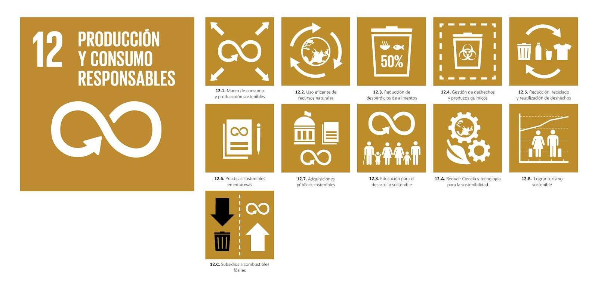

# QUIM-DETECT2  🍓🍓🍓
### Sistema Portátil de Detección de Pesticidas en Fresas mediante Espectroscopía VIS/NIR  

**QUIM-DETECT2** es un proyecto de investigación aplicada orientado al desarrollo de un **dispositivo portátil, económico y no destructivo** para la detección del pesticida organofosforado **Profenofos** en fresas, utilizando **espectroscopía de reflexión VIS/NIR (350–1000 nm)** y **análisis multivariante con Machine Learning**.  

El proyecto se alinea con el **Objetivo de Desarrollo Sostenible (ODS) 12: Producción y Consumo Responsables**, específicamente con la meta 12.4, cual busca reducir los impactos negativos de sustancias químicas peligrosas a lo largo de su ciclo de vida., promoviendo la gestión ecológica de productos químicos agrícolas y la reducción de riesgos para la salud humana y el medio ambiente.  

---

## 🎯 Objetivo General  

Desarrollar un **sistema portátil de bajo costo** capaz de identificar la presencia de residuos de *Profenofos* en fresas mediante la caracterización de su huella espectral.

---

## ⚙️ Componentes Principales  

- **Sensor óptico:** AS7343 (VIS/NIR 350–1000 nm, 18 canales espectrales).  
- **Módulo mecánico:** Servomotor y motor a paso para rotación controlada de la fresa y promediado espectral.  
- **Calibración:** Placa de teflón blanco (~97% reflectancia) o superficie blanca estandarizada.  
- **Carcasa y óptica:** Caja rígida con sellado óptico, ventana desmontable y compartimentos separados para electrónica y óptica.  
- **Procesamiento:** Algoritmos de Machine Learning (SVM, Random Forest, ANN) para clasificación de muestras contaminadas vs. no contaminadas.  

---

## 🧠 Metodología  

1. **Captura espectral:** Adquisición multicanal en el rango 400–1050 nm.  
2. **Preprocesamiento:** Filtrado de ruido, normalización, PCA y eliminación de outliers.  
3. **Entrenamiento ML:** Modelos supervisados para detección de residuos de *Profenofos*.  
4. **Validación:** Comparación frente a espectrómetros comerciales (PS-100, Apogee Instruments) y referencias científicas (*Soltani Nazarloo et al., 2021*).  

---

## 🧩 Diseño del Sistema  

- Diseño **modular** y de **mantenimiento rápido**.  
- **Ventana óptica desmontable** para limpieza y reemplazo.  
- **Superficies lisas y sellado óptico** para evitar contaminación de luz o humedad.  
- **Protección eléctrica** mediante fusibles y aisladores.  
- **Soporte fijo** con servomotor que mantiene distancia constante entre la muestra y el sensor.  

---

## 🧪 Referencias Científicas  

- Soltani Nazarloo, A., et al. (2021). *Feasibility of Using VIS/NIR Spectroscopy and Multivariate Analysis for Pesticide Residue Detection in Tomatoes.*  
- Apogee Instruments PS-100 – Compact VIS/NIR Spectrometer (350–1100 nm).  

---

## 👥 Equipo de Trabajo  

- **Matias Dario Huerta Cruz**  
- **Andres Steven Rodas Janampa**  
- **Jorge Esteban Roldan Montalvan**  
- **Juan Diego Lopez Vega**  
- **Camilla Vanessa Pacora Mendoza**  

---

## 🎓 Proyecto Académico  

Proyecto desarrollado para el curso **Proyectos de Ingeniería I – 2025-II**  
**Universidad Peruana Cayetano Heredia (UPCH)**  
Facultad de Ciencias e Ingeniería – **Carrera de Ingeniería Informática**

---
